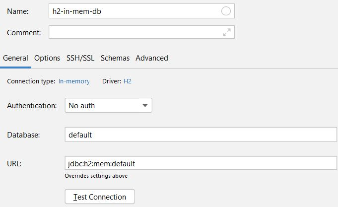

# Status

[](https://www.repostatus.org/#wip)

# Introduction

This repository is part of my upcoming youtube series `Persistence Operations`.

This demo project is supposed to give the trainee a brief idea of the concepts.

## App

[]()

## Features

* [x] Spring Boot and Java 14
* [x] H2 in memory

## Todos for further versions

Implement demo about:

- https://docs.jboss.org/hibernate/core/3.3/reference/en/html/objectstate.html#objectstate-modifying
- https://stackoverflow.com/questions/2573739/what-are-detached-persistent-and-transient-objects-in-hibernate
- Maybe: DUAL Demo
- Queries: https://www.baeldung.com/spring-data-jpa-query
- optimistic (with `@Version`) vs. pessimistic locking, see https://www.baeldung.com/jpa-optimistic-locking
  plus https://stackoverflow.com/questions/58786195/what-is-the-relation-between-spring-transactional-and-spring-lock-annotation/
-

## Execute

### Main program

Run the ```main``` method in **each** module.

### Manual sequence try out

To get familiar with the sequence table feel free to create a datasource with intelliJ with the following steps:

1.



2.

Open a new query console and execute

```h2
CREATE TABLE PERSON
(
  EMAIl      VARCHAR(255) PRIMARY KEY,
  FIRST_NAME VARCHAR(255),
  LAST_NAME  VARCHAR(255)
);
```

## Articles

### Transactions

https://dzone.com/articles/spring-transaction-propagation

https://docs.spring.io/spring-framework/docs/current/reference/html/data-access.html#transaction-declarative

### Hibernate

https://docs.jboss.org/hibernate/core/3.3/reference/en/html/objectstate.html#objectstate-modifying

https://docs.spring.io/spring-boot/docs/2.1.0.M1/reference/html/howto-database-initialization.html

### Parent & Child POM

http://maven.apache.org/pom.html#Inheritance

https://howtodoinjava.com/maven/maven-parent-child-pom-example
