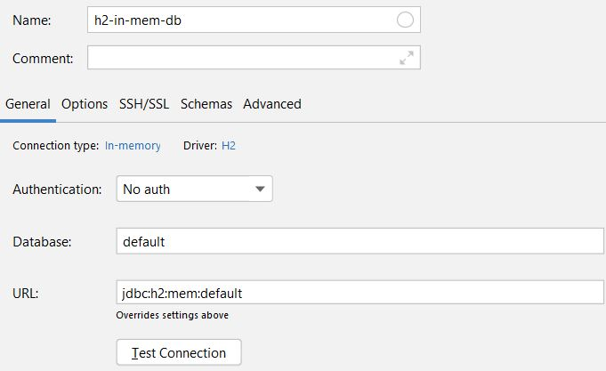

# Status

[](https://www.repostatus.org/#wip)

# Introduction

This repository is part of my upcoming youtube series on how different `JPA` functionalities work.

This demo project is supposed to give the trainee a brief idea of the concepts.

## App

[]()

## Features

* [x] Spring Boot and Java 14
* [x] H2 im memory

## Todos for further versions

## Execute

### Main program

Run the ```main``` method in each module.

### Manual sequence try out

To get familiar with the sequence table feel free to create a datasource with intelliJ with the following steps:

1.



2.

Open a new query console and execute

```h2
CREATE SEQUENCE init_sequence
START WITH 1
INCREMENT BY 1
MINVALUE 1;

SELECT init_sequence.nextval FROM dual; 
```


