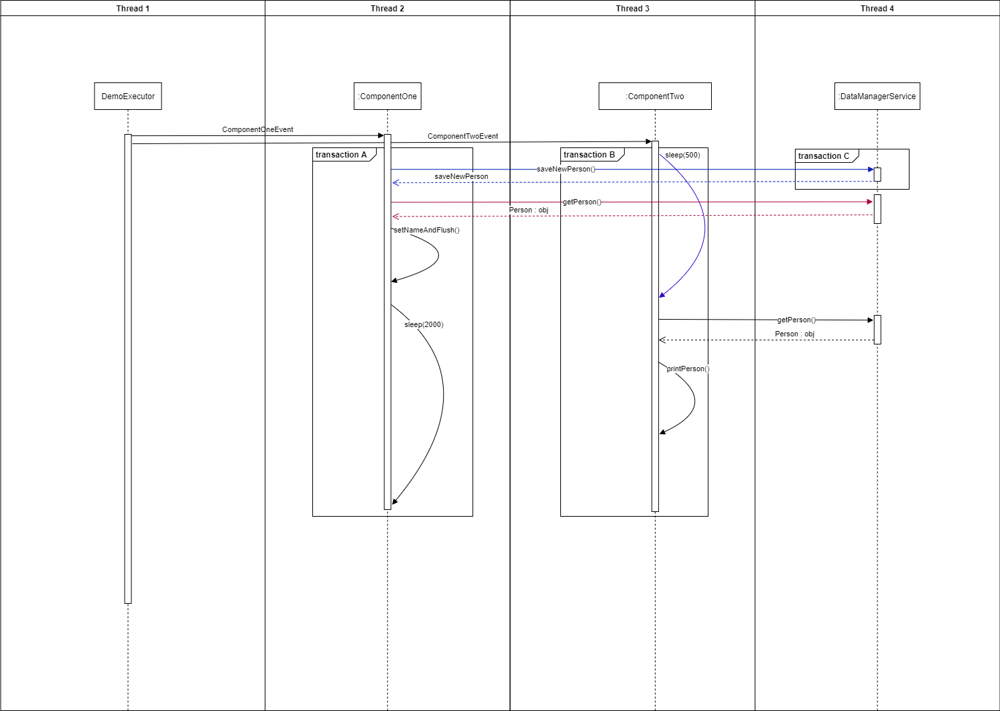
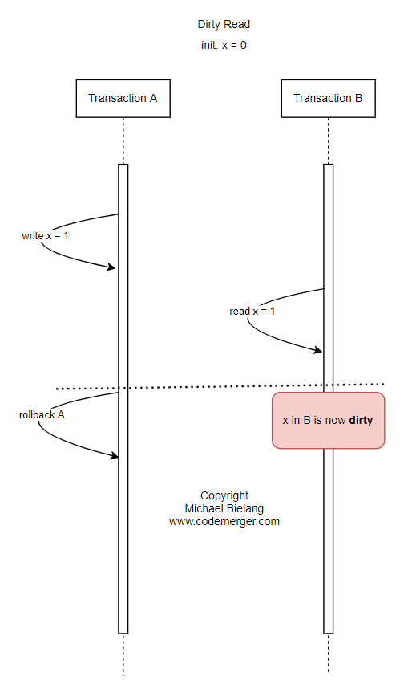
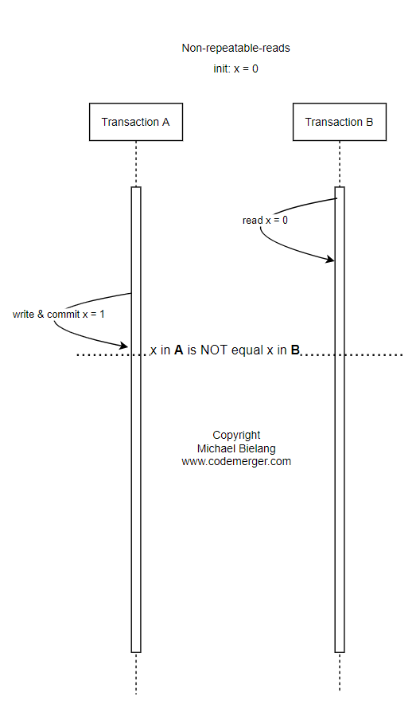
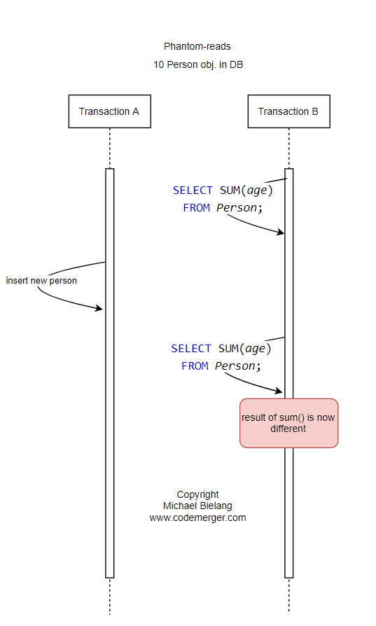
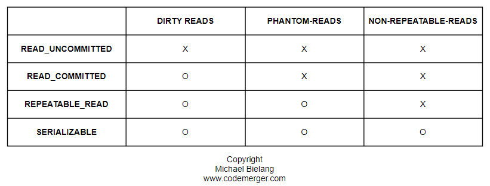

## Status

[](https://www.repostatus.org/#wip)

## Module

This module presents Spring Transactional features such as propagation and isolation level.

## Features

* [x] Spring Boot and Java 14
* [x] H2 in memory

## Execute

### Main program

Run the ```main``` method in the TransactionalApplication class.

## Isolation - Sequence diagram



## Read options

### Dirty read



### Non-repeatable read



### Phantom read



### Summary



## Articles

### Transactions

https://dzone.com/articles/spring-transaction-propagation

https://docs.spring.io/spring-framework/docs/current/reference/html/data-access.html#transaction-declarative

### Isolations

https://www.postgresql.org/docs/9.5/transaction-iso.html
